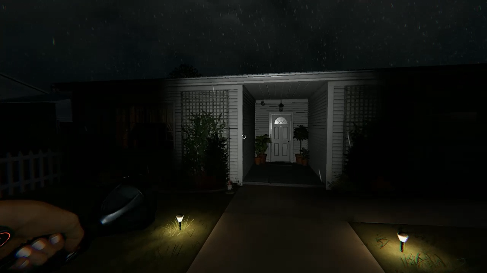
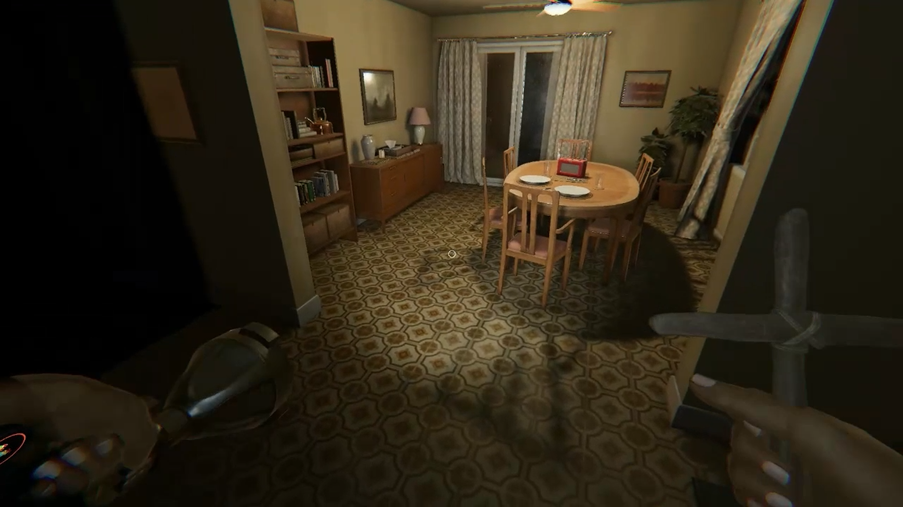
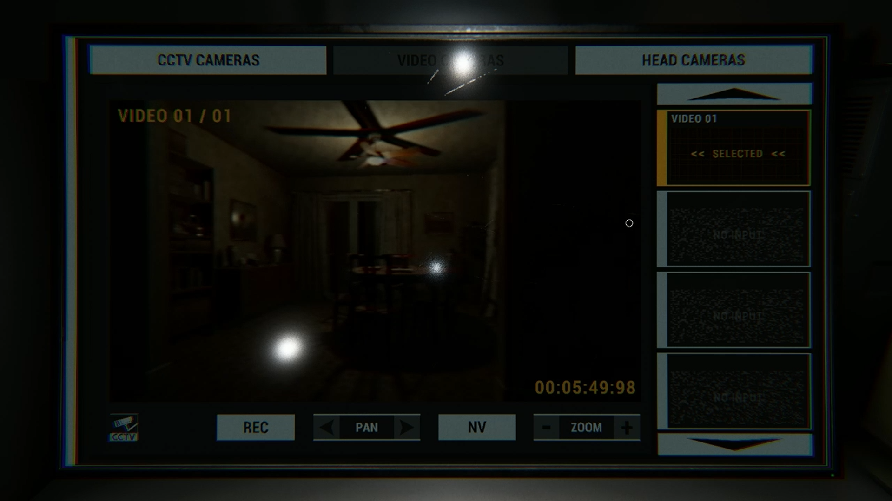

# Especificação da Implementação

> [!CAUTION]
> - Você <ins>**não pode utilizar ferramentas de IA para escrever esta
>   especificação**</ins>

> [!WARNING]
> - Após a entrega da primeira versão completa, esta especificação não
>   poderá ser alterada. A implementação final deverá corresponder ao que
>   estiver descrito neste arquivo.

## Integrantes da dupla

- **Aluno 1 - Nome**: <mark>`Guilherme Loeck`</mark>
- **Aluno 1 - Cartão UFRGS**: <mark>`00228304`</mark>

## Detalhes do que será implementado

- **Título do trabalho**: <mark>`Phasmophilia`</mark>
- **Parágrafo curto descrevendo o que será implementado**: <mark>`A minha aplicação será uma versão mais simples do jogo Phasmophobia, focada na parte de explorar uma casa no escuro porém utilizando uma lanterna. O jogador terá que andar pela casa para concluir os objetivos, interagindo com o cenário através de portas e armários e usando uma lanterna para alterar a iluminação.`</mark>

## Especificação visual

### Vídeo - Link

> [!IMPORTANT]
> - Coloque aqui um link para um vídeo que mostre a aplicação gráfica
>   de referência que você vai implementar. **Sua implementação deverá
>   ser o mais parecido possível com o que é mostrado no vídeo (mais
>   detalhes abaixo).**
> - **Você não pode escolher como referência: (1) algum trabalho realizado
>   por outros alunos desta disciplina, em semestres anteriores. (2) Minecraft.**
> - Por exemplo, você pode colocar um vídeo de um jogo que você gosta,
>   e seu trabalho final será uma re-implementação do jogo.
> - O vídeo pode ser um link para YouTube, Google Drive, ou arquivo mp4 dentro
>   do próprio repositório. Mas, garanta que qualquer um tenha
>   permissão de acesso ao vídeo através deste link.

<mark>`https://drive.google.com/file/d/1NM3YEOQ9F8PZ7ey3L8xp_vza-D7d_UEH/view?usp=drive_link`</mark>

### Vídeo - Timestamp

> [!IMPORTANT]
> - Coloque aqui um **intervalo de ~30 segundos** do vídeo acima, que
>   será a base de comparação para avaliar se o seu trabalho final
>   conseguiu ou não reproduzir a referência.

- **Timestamp inicial**: <mark>`00:00:30`</mark>
- **Timestamp final**: <mark>`00:01:00`</mark>

### Imagens

> [!IMPORTANT]
> - Coloque aqui **três imagens** capturadas do vídeo acima, que você
>   irá usar como ilustração para as explicações que vêm abaixo.
> - As imagens devem estar armazenadas neste repositório, no diretório
>   `images/spec/`, com os nomes `image1`, `image2` e `image3`.
> - Cada imagem deve usar o formato `.jpg` ou `.png`. Ajuste a extensão
>   nos vínculos abaixo para que corresponda ao arquivo armazenado.
> - Escolha imagens que correspondam a momentos do intervalo indicado
>   acima ou que sejam relevantes para a comparação com a implementação.

#### Imagem 1

- **Descrição**: <mark>`Visão da casa por fora, mostrando as malhas da fachada e a iluminação da lanterna no cenário escuro`</mark>

#### Imagem 2

- **Descrição**: <mark>`A câmera principal (visão do jogador) na sala de janta da casa, mostrando as texturas do piso, paredes e objetos, além de um item crucifixo na mão do jogador`</mark>

#### Imagem 3

- **Descrição**: <mark>`Monitor no local de início da partida (uma van estacionada na frente da casa), mostrando o ponto de vista fixado da câmera que o próprio jogador colocou na sala de janta`</mark>

## Especificação textual

Para cada um dos requisitos abaixo (detalhados no [Enunciado do Trabalho final - Moodle](https://moodle.ufrgs.br/mod/assign/view.php?id=6302370)), escreva um parágrafo **curto** explicando como este requisito será atendido, apontando itens específicos do vídeo/imagens que você incluiu acima que atendem estes requisitos.

### Malhas poligonais complexas
<mark>`Os modelos para fazer toda a estrutura da casa (piso, paredes, objetos, etc) serão importados e o cenário 3D do jogo vai ser feito usando malhas de triângulos. A intenção é montar essa estrutura o mais próxima possível visualmente do mapa mostrado no vídeo e nas imagens, sem considerar efeitos de clima (como a chuva, por exemplo) para não dificultar a implementação.`</mark>

### Transformações geométricas controladas pelo usuário
<mark>`Além da movimentação básica do jogador usando o teclado para se movimentar e o mouse para controlar a direção da visão, será possível interagir com as portas dos cômodos e dos armários (usados para se esconder do fantasma enquanto ele estiver caçando). O jogador também poderá pegar alguns objetos do chão ou escondidos em armários para segurar no inventário.`</mark>

### Diferentes tipos de câmeras
<mark>`A câmera principal é em primeira pessoa a partir da visão do jogador, pois é assim que ele irá explorar a casa em busca dos objetos necessários para concluir a missão. O outro tipo de câmera que será implementado é o ponto de vista do item câmera no jogo, que pode ser colocado dentro da casa pelo jogador e observado através do monitor que estará disponível na van.`</mark>

### Instâncias de objetos
<mark>`A imagem 2 mostra como os objetos vão ser implementados, como nas cadeiras da mesa de janta ou nos armários de diferentes tipos que podem ser abertos ou não, usando matrizes de transformação para os devidos ajustes no cenário.`</mark>

### Testes de intersecção
<mark>`Como o jogador não deve atravessar paredes e portas, muito menos atravessar os móveis do cenário, serão implementados testes de colisão definindo os limites (invisíveis) ao redor desses objetos para restringir a movimentação do personagem dentro da casa.`</mark>

### Modelos de Iluminação em todos os objetos
<mark>`O ambiente do jogo é bem escuro (porém ainda visível) e a iluminação principal vai ser a partir da lanterna que o jogador pode usar, que projeta uma fonte de luz no formato de cone em frente ao jogador (observado na fachada da casa na imagem 1 e durante o vídeo). Se possível, alguns pontos de iluminação fixos como luminárias serão inseridas no jogo.`</mark>

### Mapeamento de texturas em todos os objetos
<mark>`Os objetos, pisos e paredes do cenário vão ter texturas aplicadas para que fiquem o mais próximo possível do jogo original, como o visual de carpete no chão da sala e o padrão do piso da cozinha, além dos diferentes papéis de parede dos cômodos.`</mark>

### Movimentação com curva Bézier cúbica
<mark>`Para representar a movimentação com curva será utilizado um objeto “ghost orb” que é basicamente uma bolinha branca se movimentando pelo cenário. Ela indica a atividade paranormal no jogo. Poderá ser um dos objetos que devem ser obtidos pelo jogador para concluir a missão ou apenas um objetivo secundário, como visualizar a bolinha através do monitor na van que mostra o feed da câmera posicionada dentro da casa pelo jogador (imagem 3). Caso essa implementação se torne um tanto complexa ou não faça sentido dentro do propósito do jogo, a movimentação com curva será aplicada no trajeto que o fantasma poderá realizar durante a caçada.`</mark>

### Animações baseadas no tempo ($\Delta t$)
<mark>`As atualizações dentro do jogo como a posição do jogador, câmera ou movimentação do “ghost orb” e do fantasma vão ter suas velocidades multiplicadas pelo tempo que leva entre a renderização dos quadros (delta T) dentro do loop principal no código para manter a fluidez normal do jogo onde quer que ele seja executado.`</mark>

### Funcionalidade extra obrigatória

> [!IMPORTANT]
> - Descreva a funcionalidade extra relacionada à Computação Gráfica
>   que será implementada.
> - Esta funcionalidade também deverá ser documentada no arquivo
>   `README.md` da entrega final.

<mark>`Uma interface gráfica simples será implementada para registrar o andamento das missões do jogo (ex: objetos coletados, “ghost orb” encontrado) e possibilitar o gerenciamento de itens no inventário. O painel de itens dentro da van (que aparece no início e no final do vídeo) pode ser adaptado para o gerenciamento desses itens nessa versão nova do jogo.`</mark>

> Comentário Professor: Não vejo muito sentido na interface gráfica para este jogo. Para obter o efeito visual da lanterna conforme a referência, sugiro fortemente que você implemente sombras como funcionalidade extra.

> Comentário Professor: Alternativamente, detalhe melhor a interface gráfica: você poderá utilizar o mouse para gerenciar os itens? Qual seria um exemplo visual da interface ou do HUD (Heads-Up Display) que você pretende implementar? Inclua uma imagem de referência.

## Limitações esperadas

> [!IMPORTANT]
> - Coloque aqui uma lista de detalhes visuais ou de interação que
>   aparecem no vídeo e/ou imagens acima, mas que você **não pretende
>   implementar** ou que você **irá implementar parcialmente**.
> - Para cada item, **explique por que** não será implementado ou por
>   que será implementado parcialmente.

<mark>`- No jogo original, o jogador precisa identificar qual é o tipo de fantasma que está assombrando o local a partir de algumas      evidências que podem aparecer ou não na partida. Durante a investigação, o fantasma pode aparecer e matar o jogador antes que ele consiga completar o objetivo.  Na minha versão, decidi mudar o objetivo para algo mais simples para focar nos aspectos de computação gráfica que estudamos na disciplina. O jogador deverá encontrar três objetos escondidos no mapa (no chão dos cômodos, dentro de armários, etc) e colocá-los em um altar para ‘exorcizar’ o fantasma e vencer a partida (inspirado em outro jogo de terror muito parecido chamado Demonologist). Toda a parte gráfica (cenário, objetos, itens do jogador) será baseada no Phasmophobia, apenas o objetivo principal que será mais simples.`</mark>

<mark>`- Haverá somente um tipo de fantasma e, como no jogo original, ele irá caçar de tempo em tempo para atrapalhar o jogador. O visual do fantasma será bem mais agradável também pois o objetivo não é tirar o sono de ninguém e sim aplicar os conceitos de computação gráfica.`</mark>

<mark>`- Caso não seja possível implementar os closets para se esconder do fantasma (como mostrado no início do vídeo), esses pontos de esconderijo serão no formato de armário de metal (que aparece no timestamp 00:01:37 do vídeo) e que possuem o mesmo propósito.`</mark>

<mark>`- Alguns objetos secundários mostrados no vídeo que podem ser pegos (ex: o chinelo no quarto, a batata escondida no armário) podem não aparecer na versão final, pois o foco será nos objetos especiais que fazem parte do objetivo do jogo para exorcizar o fantasma (pedaço de osso, boneca voodoo e baralho de tarot são exemplos de objetos que existem no jogo original e poderão fazer parte do objetivo principal).`</mark>

<mark>`- Os efeitos de clima como a chuva caindo no vídeo não serão implementados para diminuir a complexidade do código.`</mark>

<mark>`- A van (ponto de início da partida) será uma versão mais simples, mostrando o monitor da câmera que é o mais importante e talvez alguns itens de utilidade dispostos na parede como a lanterna e o cruxifixo (que pode ser usado para repelir um ataque do fantasma), assim como no jogo.`</mark>

<mark>`- A caçada do fantasma será mais simples, sem as interações com o cenário (luzes piscando, objetos voando, etc.) para facilitar a implementação. O fantasma poderá aparecer em qualquer lugar da casa, com uma velocidade de movimento mais limitada e que permita o jogador se esconder em algum armário caso não tenha sido imediatamente visto pelo fantasma enquanto a caçada estiver acontecendo.`</mark>
